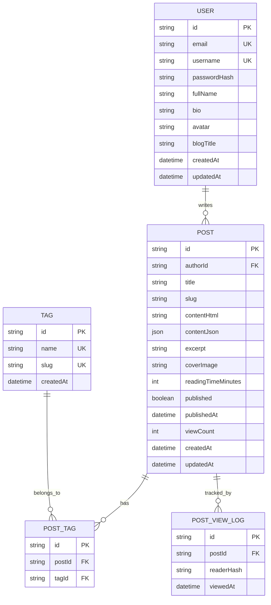

# 🗄️ Database Documentation & Data Models

Dokumen ini menjelaskan rancangan skema database **PostgreSQL** yang dikelola melalui **Prisma ORM**.

---

## 1. 📊 Entity Relationship Diagram (ERD)



---

## 2. 📜 Skema Prisma (`backend/prisma/schema.prisma`) & Konfigurasi (`prisma.config.ts`)

Proyek ini menggunakan standar resmi **Prisma 7.10.0** dengan konfigurasi terpusat dan driver adapter PostgreSQL native:

### A. Skema Model (`backend/prisma/schema.prisma`):
```prisma
datasource db {
  provider = "postgresql"
}

generator client {
  provider = "prisma-client-js"
}
```

### B. Konfigurasi Koneksi (`backend/prisma.config.ts`):
```typescript
import dotenv from 'dotenv';
import path from 'path';
import { fileURLToPath } from 'url';
import { defineConfig, env } from 'prisma/config';

const __filename = fileURLToPath(import.meta.url);
const __dirname = path.dirname(__filename);

dotenv.config({ path: path.resolve(__dirname, '../.env') });
dotenv.config();

export default defineConfig({
  schema: './prisma/schema.prisma',
  datasource: {
    url: env('DATABASE_URL'),
  },
});
```

model User {
  id           String    @id @default(uuid())
  email        String    @unique
  username     String    @unique
  passwordHash String
  fullName     String
  bio          String?   @db.VarChar(500)
  avatar       String?
  blogTitle    String?   @default("My Personal Blog")
  socialTwitter String?
  socialGithub  String?
  socialLinkedin String?
  socialWebsite String?
  
  posts        Post[]
  createdAt    DateTime  @default(now())
  updatedAt    DateTime  @updatedAt

  @@index([username])
}

model Post {
  id                 String        @id @default(uuid())
  authorId           String
  author             User          @relation(fields: [authorId], references: [id], onDelete: Cascade)
  
  title              String
  slug               String
  contentHtml        String        @db.Text
  contentJson        Json?         // Tiptap state format
  excerpt            String?       @db.VarChar(500)
  coverImage         String?
  readingTimeMinutes Int           @default(1)
  
  published          Boolean       @default(false)
  publishedAt        DateTime?
  viewCount          Int           @default(0)
  
  postTags           PostTag[]
  viewLogs           PostViewLog[]
  
  createdAt          DateTime      @default(now())
  updatedAt          DateTime      @updatedAt

  // Kunci utama: Slug unik per author (multi-tenancy)
  @@unique([authorId, slug])
  @@index([authorId])
  @@index([slug])
  @@index([published, createdAt])
}

model Tag {
  id        String    @id @default(uuid())
  name      String    @unique
  slug      String    @unique
  postTags  PostTag[]
  createdAt DateTime  @default(now())

  @@index([slug])
}

model PostTag {
  id        String   @id @default(uuid())
  postId    String
  post      Post     @relation(fields: [postId], references: [id], onDelete: Cascade)
  tagId     String
  tag       Tag      @relation(fields: [tagId], references: [id], onDelete: Cascade)

  @@unique([postId, tagId])
  @@index([postId])
  @@index([tagId])
}

model PostViewLog {
  id         String   @id @default(uuid())
  postId     String
  post       Post     @relation(fields: [postId], references: [id], onDelete: Cascade)
  readerHash String   // SHA-256 hash dari (Session Cookie / Fingerprint + IP + UA)
  viewedAt   DateTime @default(now())

  @@index([postId, readerHash, viewedAt])
  @@index([viewedAt])
}
```

---

## 3. 🔍 Logika Smart Analytics (Deduplikasi 60 Menit)

Untuk memastikan bahwa view counter akurat dan tidak di-spam:

```typescript
// Algorithm in analytics.service.ts:
const oneHourAgo = new Date(Date.now() - 60 * 60 * 1000);

// 1. Cek apakah readerHash ini sudah pernah melihat postId ini dalam 60 menit terakhir
const recentView = await prisma.postViewLog.findFirst({
  where: {
    postId: targetPostId,
    readerHash: calculatedReaderHash,
    viewedAt: { gte: oneHourAgo }
  }
});

// 2. Jika belum ada, catat log baru dan naikkan counter
if (!recentView) {
  await prisma.$transaction([
    prisma.postViewLog.create({
      data: { postId: targetPostId, readerHash: calculatedReaderHash }
    }),
    prisma.post.update({
      where: { id: targetPostId },
      data: { viewCount: { increment: 1 } }
    })
  ]);
}
```

---

## 4. 🗃️ Kamus Data (Data Dictionary)

| Tabel | Kolom | Tipe Data | Keterangan |
| :--- | :--- | :--- | :--- |
| **User** | `id` | `UUID` | Primary key unik. |
| | `username` | `VARCHAR` | Username unik huruf/angka/underscore (e.g. `garberra`). |
| | `passwordHash` | `VARCHAR` | Password di-hash menggunakan `bcryptjs`. |
| **Post** | `slug` | `VARCHAR` | Slug URL (contoh: `cara-belajar-react`). Unik per `authorId`. |
| | `contentHtml` | `TEXT` | Output HTML murni untuk render instan di reader. |
| | `contentJson` | `JSONB` | JSON state dari Tiptap editor untuk mempertahankan state format. |
| | `readingTimeMinutes` | `INT` | Dihitung otomatis: `Math.ceil(wordCount / 200)`. |
| **PostViewLog** | `readerHash` | `VARCHAR` | Hash SHA-256 dari session identifier pembaca. |
